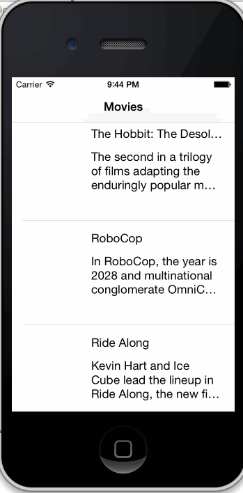

This is the rotten tomatoes app. It will use the API exposed by the Rotten Tomates site to downloaded movies list and allow users to see the list of movies and see details when they tap into one.

Time spent: 5 hours

Completed user stories:
1. Show a list of movies titles and synopsis.

Notes:
I was not able to get the image to download and setting up cocopods did not work for me. I was not able to get it to create the MyApp.xcworkspace file/folder.

